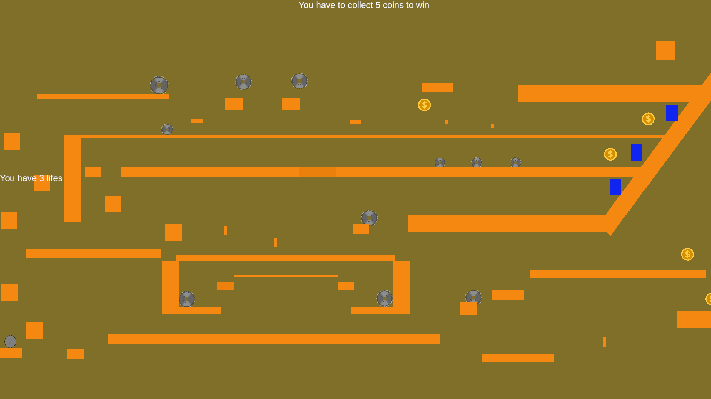
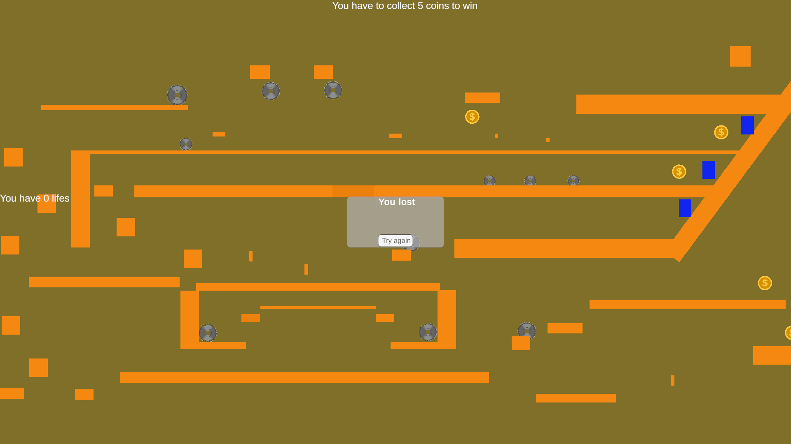
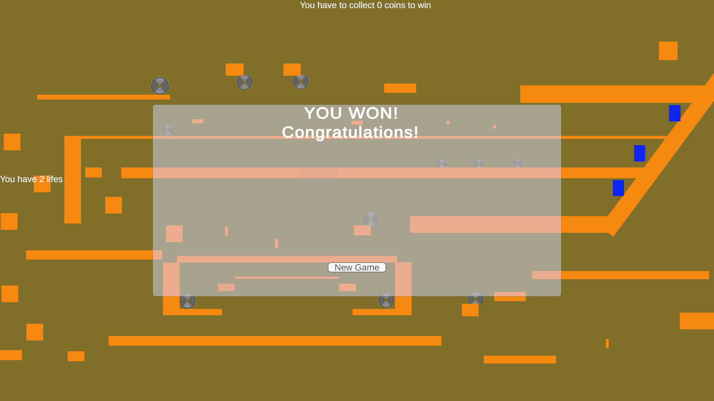
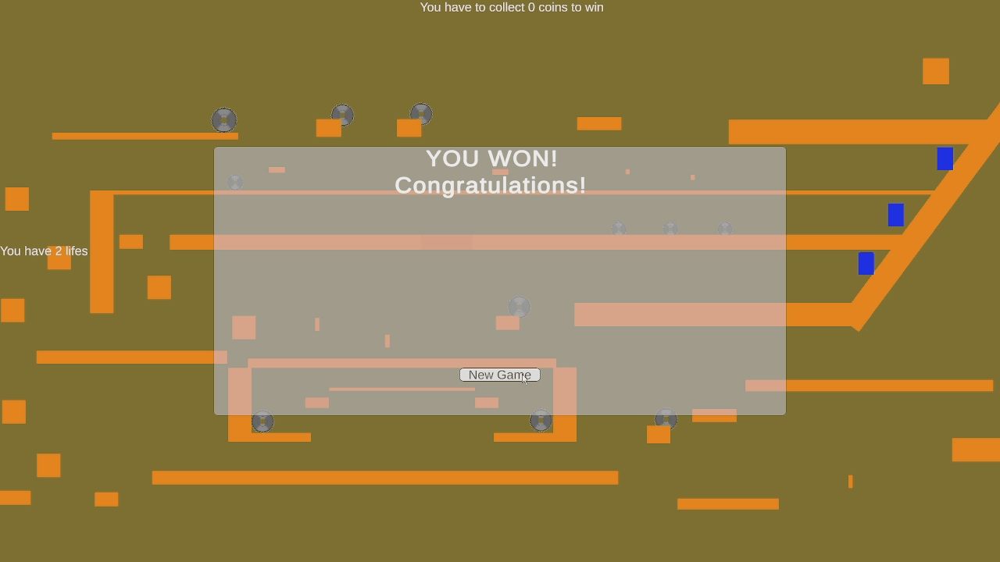

# My First Unity Project - 2D Platformer
> A simple **2D platformer** built with Unity.  
> The player controls a character that can jump across platforms, avoid obstacles (saw), and collect coins, The player has to get 5 coins to win, he has only 3 lifes to do it.
## Screenshots

## Gameplay Preview

##  How to Play
**Option 1: Download Build**  
https://drive.google.com/drive/folders/1BU8ak-rk1oBxKx1a43d1UyLVYTldX_5f?usp=drive_link
**Option 2: Build from Source**
1. Clone the repository  
2. Open the project in **Unity 6.0 LTS** (or your version)  
3. Open scene `MainScene` → Press **Play**
## Technologies Used

- **Unity** (version 6.0 LTS)  
- **C#** 
## Features

- Smooth character movement (run & jump)  
- Health system  
- game over / win menus  
- Win Logic related to the coins
- Movement of Blocks, transparent blocks
- Respawn System
- UI tools (Count of hp and coins)
## What I Learned

- Unity 2D physics (Rigidbody2D, Colliders)  
- Scene management & UI system  
- Organizing project structure & GitHub workflow  
- Writing C# Scripts
## Author 
- GitHub: [mart3r2ok]  
- Contact: [nikitakovtunovic753@gmail.com] - gmail; [mart3r2ok] - ds
